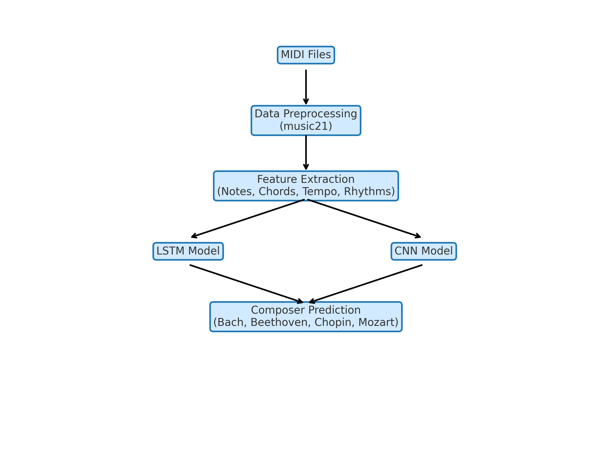

# Music Composer Classification Using Deep Learning

## Overview

This project uses **deep learning** to classify the composer of a given piece of music from **MIDI** files.  
We focus on four renowned classical composers:

- **Johann Sebastian Bach**
- **Ludwig van Beethoven**
- **Frédéric Chopin**
- **Wolfgang Amadeus Mozart**

Our models leverage **Long Short-Term Memory (LSTM)** and **Convolutional Neural Network (CNN)** architectures to learn musical patterns and predict the composer with high accuracy.

---

## Objective

The goal is to:
1. Preprocess and extract meaningful features from MIDI music files.
2. Build and train **LSTM** and **CNN** models for composer classification.
3. Evaluate model performance using **accuracy, precision, recall, and F1-score**.
4. Compare results between the two deep learning approaches.

---

## Dataset

The dataset is sourced from **[Kaggle: MIDI Classics Music Dataset](https://www.kaggle.com/)**.  
It contains **MIDI files** of classical compositions by multiple composers.  

For this project, we **filtered** the dataset to only include:
- Bach  
- Beethoven  
- Chopin  
- Mozart  

---

## Methodology



### 1. Data Preprocessing
- Load MIDI files.
- Extract notes, chords, tempo, and time signature.
- Convert musical data into numerical sequences.
- Apply data augmentation.

### 2. Feature Extraction
- **Notes and Chords** as tokenized sequences.
- **Tempo** and **Rhythmic Patterns** for added context.

### 3. Model Architecture

#### **CNN Model**
- Captures local spatial features in musical patterns.
- Works well with transformed piano roll or spectrogram representations.
  
#### **LSTM Model**
- Designed to capture temporal dependencies in music sequences.
- Input: Encoded sequences of notes/chords.
- Output: Softmax layer for 4-class classification.


### 4. Training & Evaluation
- Train models using **categorical cross-entropy loss** and **Adam optimizer**.
- Use **train/test split** (e.g., 80/20).
- Evaluate using:
  - Accuracy
  - Precision
  - Recall
  - F1-score

---

## Results
| Model  | Accuracy | Training Time | Params | 
|--------|----------|-----------|--------|
| CNN    |    99.11%   |    2min30s    |   5.3M |   
| CNN-LSTM Hybrid  |    48.77%  |    55min    |   516K  |  
| LSTM   |    50%   |    15min    |   555K  |    


---

## Installation & Usage

### **1. Clone the Repository**
```
git clone https://github.com/webJdi/music-classification.git
cd music-classification
```
### **2. Install Dependencies**
```
pip install -r requirements.txt
```
### **3. For Execution**

- Load the files in the drive and run all the cells

## Requirements

- Python 3.8+
- TensorFlow / Keras
- NumPy
- Pandas
- music21
- scikit-learn
- Matplotlib

## Contributors

- Sai Navyesh Pamarti
- Shruthi AK
- Suman Senapati

## Future Improvements

- Add more composers for classification.
- Implement Transformer-based architectures.
- Use transfer learning with pre-trained music models.
- Deploy the model as a web app for interactive use.


